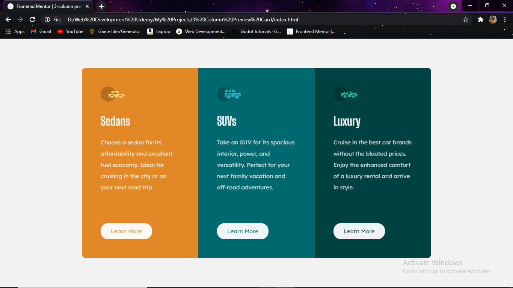
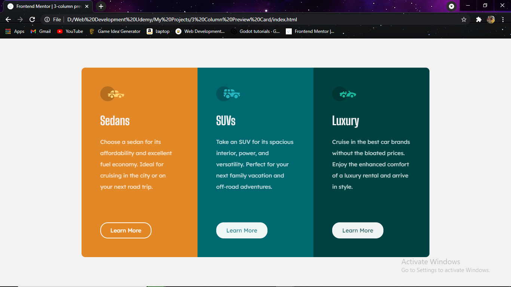
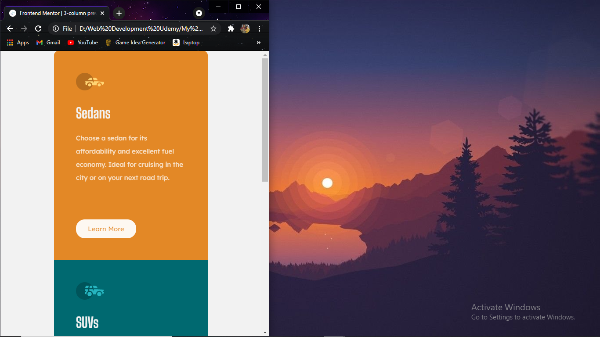

# Frontend Mentor - 3-column preview card component solution

This is a solution to the [3-column preview card component challenge on Frontend Mentor](https://www.frontendmentor.io/challenges/3column-preview-card-component-pH92eAR2-). Frontend Mentor challenges help you improve your coding skills by building realistic projects. 

## Table of contents

- [Overview](#overview)
  - [The challenge](#the-challenge)
  - [Screenshot](#screenshot)
  - [Links](#links)
- [My process](#my-process)
  - [Built with](#built-with)
  - [What I learned](#what-i-learned)
  - [Useful resources](#useful-resources)
- [Author](#author)

**Note: Delete this note and update the table of contents based on what sections you keep.**

## Overview

### The challenge

Users should be able to:

- View the optimal layout depending on their device's screen size
- See hover states for interactive elements

### Screenshot





### Links

- Solution URL: [Add solution URL here](https://github.com/Arnav-Ghatti/3-Column-Preview-Card)
- Live Site URL: [Add live site URL here](https://your-live-site-url.com)

## My process

### Built with

- Semantic HTML5 markup
- CSS custom properties
- Flexbox
- VS Code
- Github

### What I learned

```css
@media screen and (max-width: 700px){
    #sedan {
        border-radius: 0;
        border-top-left-radius: 10px;
        border-top-right-radius: 10px;
        width: 250px;
    }
    #suv {
        width: 250px;
    }
    #luxary {
        border-radius: 0;
        border-bottom-left-radius: 10px;
        border-bottom-right-radius: 10px;
        width: 250px;
    }
}
```

### Useful resources

- [Stack Overflow](https://stackoverflow.com/questions/39211744/how-to-add-a-transparent-hover-state-to-a-button) - This helped me to make the hover effect for the buttons

## Author

- Frontend Mentor - [@Arnav-Ghatti](https://www.frontendmentor.io/profile/Arnav-Ghatti)
- Facebook - [Arnav Ghatti](https://www.facebook.com/arnav.ghatti.3/)